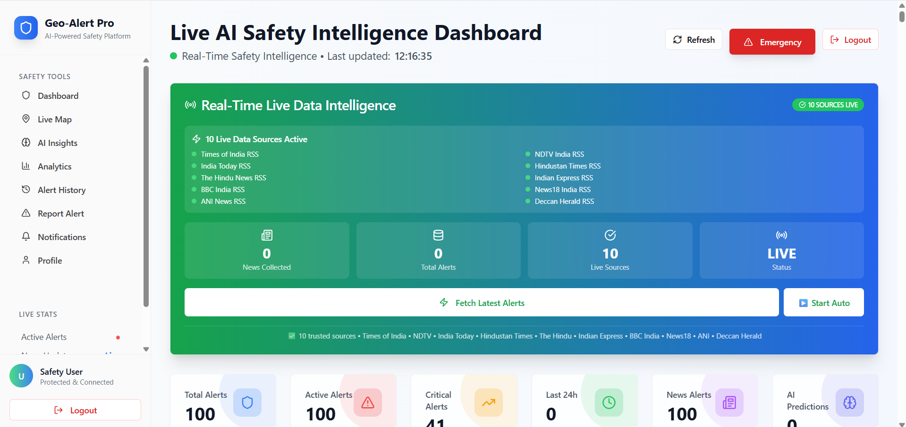

# GeoAlert 🌍

## 🌐 Live Demo
https://geo-alert-your-safety-companion-a22cca4d.base44.app

## 🧠 Overview
GeoAlert is an AI-based real-time alert system that provides
early warnings for floods, accidents, and animal trespassing.

## ✨ Features
- Live map alerts
- AI prediction system
- Community reporting
- Real-time notifications

## 🛠️ Tech Stack
- Frontend: HTML, CSS, JavaScript
- Backend: Python / Node.js
- AI/ML: TensorFlow / Scikit-learn

## 🔒 Source Code
The source code is private for security and production reasons.
## 📸 Screenshots

